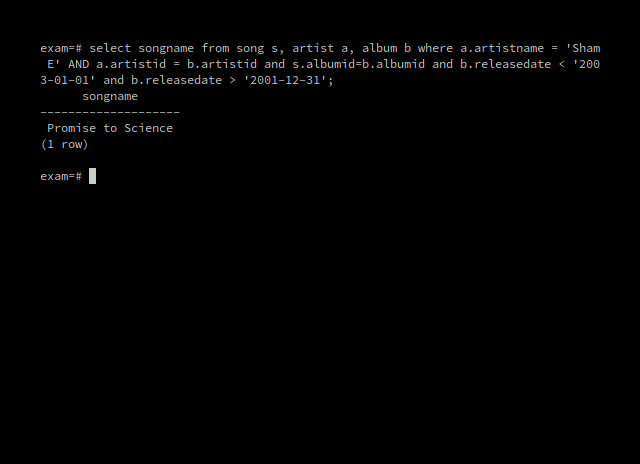
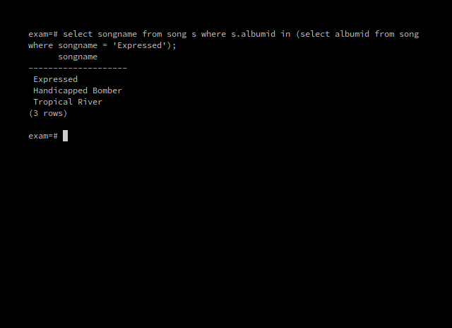
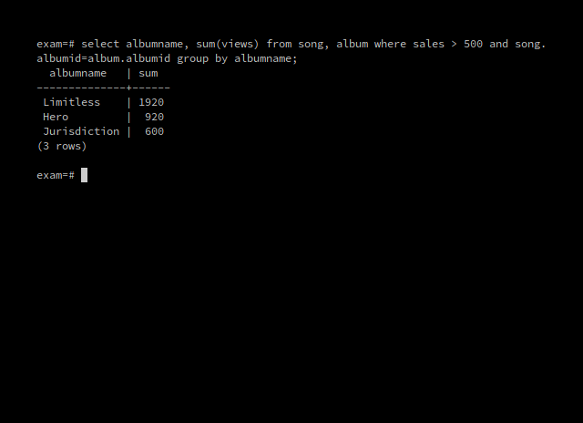
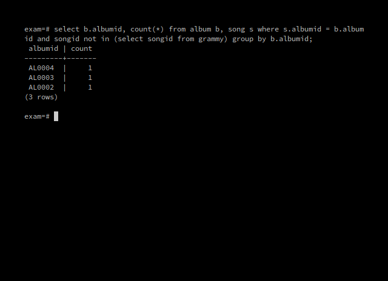
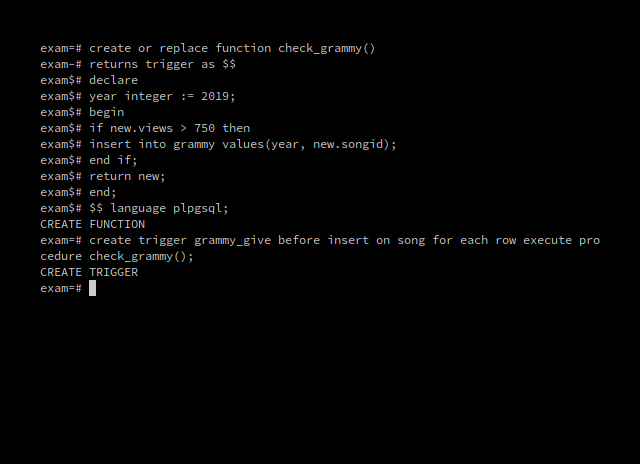
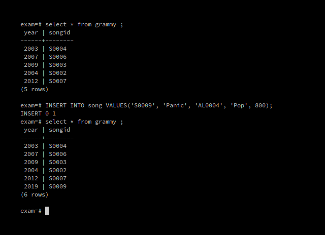
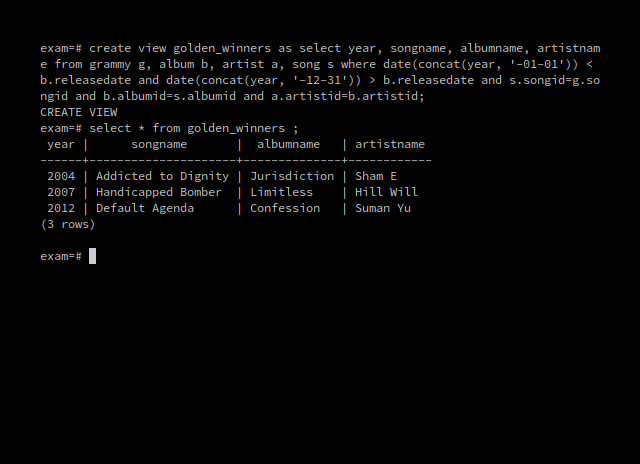
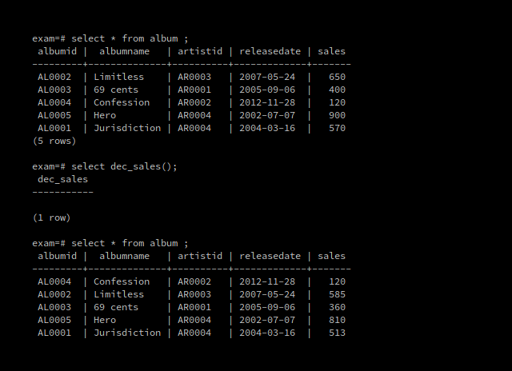
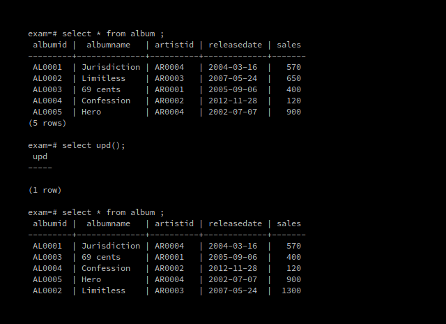
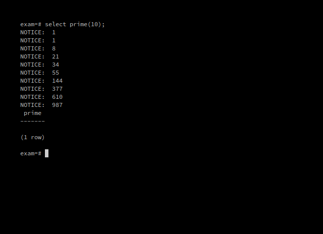

1. Create and populate shown tables. Check the following constraints:
	1. Song_ID should be of the format “S00__”
	1. Album_ID should be of the format “AL00__”,
	1. Album_ID should be of the format “AL00__”,
	1. Artist_ID should be of the format “AR00__”.

```sql
create table song(
   songid varchar(10) check(songid like 'S00__'),
   songname varchar(25),
   albumid varchar(10) check(albumid like 'AL00__'),
   genre varchar(10),
   views integer);

INSERT INTO song VALUES('S0001', 'Panic and Sentiment', 'AL0004', 'Pop', 450);
INSERT INTO song VALUES('S0002', 'Addicted to Dignity', 'AL0001', 'Rap', 600);
INSERT INTO song VALUES('S0003', 'Expressed', 'AL0002', 'Pop', 500);
INSERT INTO song VALUES('S0004', 'Promise to Science', 'AL0005', 'Rock', 920);
INSERT INTO song VALUES('S0005', 'Comfortable Illusion', 'AL0003', 'Rock', 760);
INSERT INTO song VALUES('S0006', 'Handicapped Bomber', 'AL0002', 'Rap', 1000);
INSERT INTO song VALUES('S0007', 'Default Agenda', 'AL0004', 'Jazz', 260);
INSERT INTO song VALUES('S0008', 'Tropical River', 'AL0002', 'Pop', 420);

create table album(
   albumid varchar(10) check(albumid like 'AL00__'),
   albumname varchar(25),
   artistid varchar(10) check(artistid like 'AR00__'),
   releasedate date,
   sales integer);

INSERT INTO album VALUES('AL0001', 'Jurisdiction', 'AR0004', '16-03-2004', 570);
INSERT INTO album VALUES('AL0002', 'Limitless', 'AR0003', '24-05-2007', 650);
INSERT INTO album VALUES('AL0003', '69 cents', 'AR0001', '6-09-2005', 400);
INSERT INTO album VALUES('AL0004', 'Confession', 'AR0002', '28-11-2012', 120);
INSERT INTO album VALUES('AL0005', 'Hero', 'AR0004', '7-07-2002', 900);

create table artist(
   artistid varchar(10) check(artistid like 'AR00__'),
   artistname varchar(25),
   country varchar(20));

INSERT INTO artist VALUES('AR0001', 'Natalia Finch', 'France');
INSERT INTO artist VALUES('AR0002', 'Suman Yu', 'India');
INSERT INTO artist VALUES('AR0003', 'Hill Will', 'USA');
INSERT INTO artist VALUES('AR0004', 'Sham E', 'France');

create table grammy (
   year integer, songid varchar(10));

INSERT INTO grammy VALUES(2003, 'S0004');
INSERT INTO grammy VALUES(2007, 'S0006');
INSERT INTO grammy VALUES(2009, 'S0003');
INSERT INTO grammy VALUES(2004, 'S0002');
INSERT INTO grammy VALUES(2012, 'S0007');

```


2. List all the songs by Sham E in the year 2002.

```sql
select songname from song s, artist a, album b 
   where a.artistname = 'Sham E' AND a.artistid = b.artistid 
      and s.albumid=b.albumid and b.releasedate < '2003-01-01' 
	  and b.releasedate > '2001-12-31';
```




3. List all songs in the same album as Expressed.

```sql
select songname from song s where 
   s.albumid in 
   (select albumid from song where songname = 'Expressed');
```




4. Display the name and total number of views of all albums with sales more than 500.

```sql
select albumname, sum(views) from song, album 
   where sales > 500 and song.albumid=album.albumid 
   group by albumname;
```




5. Display the number of songs that did not win a Grammy in each album.

```sql
select b.albumid, count(*) from album b, song s 
   where s.albumid = b.albumid and songid not in 
      (select songid from grammy) group by b.albumid;
```




6. Create a Trigger such that whenever a new song is added, if it has more than 750 views, it wins a Grammy in that year itself.

```sql
create or replace function check_grammy()
returns trigger as $$
declare
year integer := 2019;
begin
if new.views > 750 then
insert into grammy values(year, new.songid);
end if;
return new;
end;
$$ language plpgsql;

create trigger grammy_give 
   before insert on song 
   for each row 
   execute procedure check_grammy();
```




7. Create a view “Golden Winners” which contains the name of the song,album and artists
which won the Grammy on the year they released.

```sql
create view golden_winners as 
   select year, songname, albumname, artistname 
      from grammy g, album b, artist a, song s 
	  where date(concat(year, '-01-01')) < b.releasedate 
	     and date(concat(year, '-12-31')) > b.releasedate 
		 and s.songid=g.songid and b.albumid=s.albumid 
		 and a.artistid=b.artistid;
```




8. Decrease the sales by 10% for all albums released before 2009. Perform the operation
using cursor.

```sql
create or replace function dec_sales()
returns integer as $$
declare
cur cursor for select * from album;
rec record;
begin
open cur;
loop
fetch cur into rec;
exit when not found;
if rec.releasedate < '2009-01-01' then
update album set 
   sales = 0.9 * sales 
   where current of cur;
end if;
end loop;
return null;
end;
$$
language plpgsql;
```




9. You are given a table, BST, containing two columns: N and P, where N represents the
value of a node in a Binary Tree, and P is the parent of N.
Write a query to find the node type of Binary Tree ordered by the value of the node.
Output one of the following for each node:
	- Root: If node is the root node.
	- Leaf: If node is leaf node.
	- Inner: If node is neither root nor leaf node

```sql
create table bst(
n integer,
p integer);

INSERT INTO bst VALUES(1, 2);
INSERT INTO bst VALUES(3, 2);
INSERT INTO bst VALUES(6, 8);
INSERT INTO bst VALUES(9, 8);
INSERT INTO bst VALUES(2, 5);
INSERT INTO bst VALUES(8, 5);
INSERT INTO bst(n) VALUES(5);

select n, case
when p is null then 'Root'
when exists (select * from bst b2 where b2.p=b1.n) then 'Inner'
else 'Leaf'
end
from bst b1 order by n;
```



10. For the above database, multiply the sales value of all albums which have received grammy award with the number of grammys received and update the sales column.

```sql
create or replace function upd()
returns integer as $$
declare
cur cursor for select * from album;
cnt integer
rec record;
begin
    open cur;
    loop
    fetch cur into rec;
    exit when not found;
	select into cnt from album b, song s, grammy g
		where b.albumid=s.albumid and g.songid=s.songid;
	if cnt > 0 then
		update album set sales = sales * cnt;
	end if;
    end loop;
close cur;
return null;
end;
$$ language plpgsql;
```




11. Write a function to find the first n Fibonacci numbers which are not prime and store them into a table.

```sql
create or replace function prime(n integer)
returns integer as
$$
declare
	i integer := 1;
	j integer := 1;
	k integer;
	c integer := 0;
	flag integer := 0;
begin
	raise notice '%', i;
	raise notice '%', j;
	while c < n loop
		select i+j, i into i, j;
		for p in 2..i/2 loop
			if n%p=0 then
				flag = 1;
			end if;
		end loop;
		if flag=0 then
			raise notice '%', i;
			c := c+1;
			flag := 0;
		end if;
	end loop;
end;
$$
language plpgsql;
```

